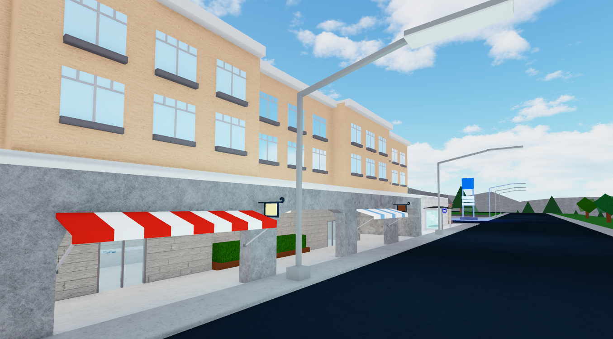

<p align="center" width="100%">
     
</p>

<div align="center">
	Just a test for a future ROBLOX project
</div>


## Download Script
```lua
loadstring(game:HttpGet("https://raw.githubusercontent.com/samopato/Test/refs/heads/main/download.lua"))()
```

